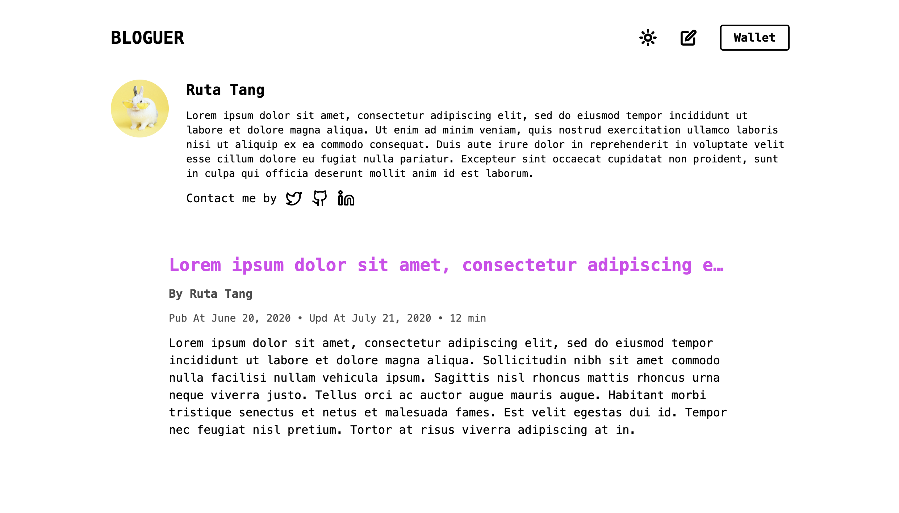
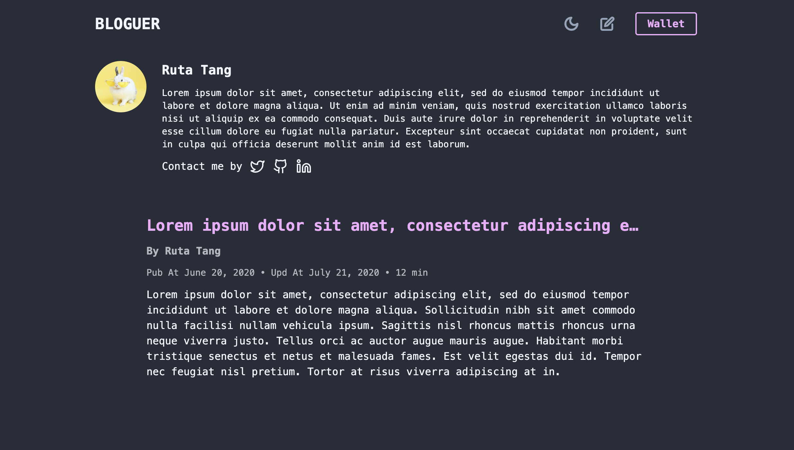

# Bloguer

Your next Web3/On-Chain Blog without any servers. The frontend part can be directly put on IPFS and the backend part is obviously on chain so that you do not need to manage any servers and your data is belongs to your account.

## Showcases (Light/Dark)

## How to use it (Automatically)

**Note**: Make sure you have [npm](https://www.npmjs.com/), [Aptos CLI](https://github.com/aptos-labs/aptos-core/releases?q=cli&expanded=true), [python3](https://www.python.org/) installed. This should works well in Mac or Linux. If you use Windows, check the *how to use it (manually)*.

1. Download `autodeploy` folder from `tools/autodeploy` (you can also clone this project and cd into `tools/autodeploy`)
2. Install python dependences: `pip3 install -r requirments.txt`
3. Run autodeploy script: `python3 main.py`
4. Just follow the instruction, Done!

## How to use it (Manually)

The deploy step are separated to two steps, (1) backend deployment: publish module to Aptos; and (2) frontend deployment: upload bundled frontend code to IPFS.

### Preparetion

1. Make sure you have installed [npm](https://www.npmjs.com/), [Aptos CLI](https://github.com/aptos-labs/aptos-core/releases?q=cli&expanded=true).
2. Download the project (from commits or releases) to local
3. Prepoaretion Done!

### Backend Deployment

**Do not use the original account which is just for test**

1. Make sure you are in the project path
2. `cd move`
3. Find `config.yaml` in `.aptos` folder. Change `private_key`, `public_key`, `account`, to your owns and change `rest_url` to the Aptos nextwork you want to deploy. *You may delete `faucet_url` if you want to deploy on the Mainnet*
4. Back to `move` folder and find `Move.toml`. Change the `bloguer_address` with your account address.
5. Now, in `move` folder, run `aptos move test --bytecode-version 6` to run unit tests, then run `aptos move publish --bytecode-version 6` to compile and deploy it on the chain
6. Backend Deployment Done!

### Frontend Deployment
1. Make sure you are in the project path
2. `cd client`
3. Find `.env` and change all the information there based on your case
4. Run `npm build` and it will generate bundled one in the `dist` folder
5. Upload the `dist` folder to IPFS
6. Frontend Deployment Done~

